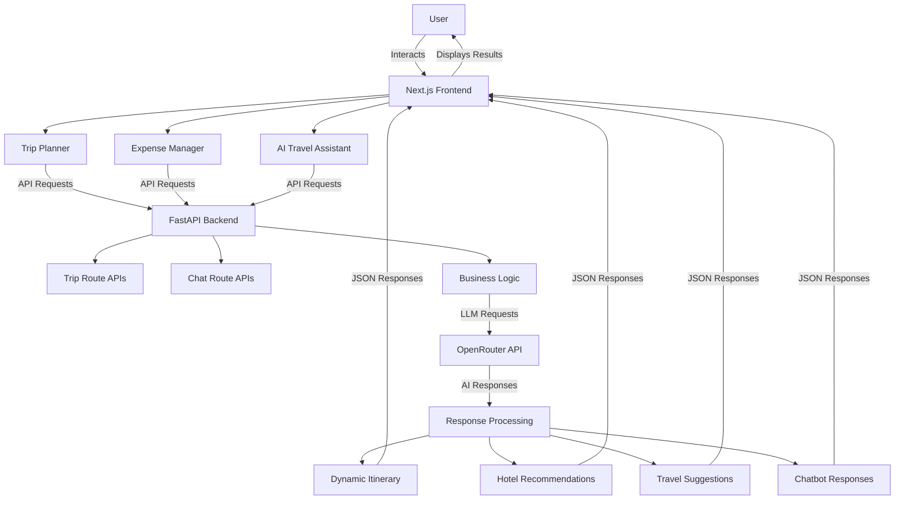

#  TripGenie AI - AI-Powered Smart Travel Planner

> **Revolutionizing Travel Planning with AI** — Generate personalized itineraries, get intelligent travel recommendations, track expenses, and chat with an AI travel assistant—all in one platform.

[](https://www.python.org/)
[](https://fastapi.tiangolo.com/)
[](https://nextjs.org/)
[](https://react.dev/)
[](https://www.typescriptlang.org/)
[](https://tailwindcss.com/)
[](https://openrouter.ai/)
[](https://vercel.com/)
[](https://render.com/)

---

##  Overview

**TripGenie AI** is an intelligent travel planning platform that leverages Large Language Models to generate personalized travel itineraries, provide expert travel recommendations, and assist travelers with comprehensive travel guidance. The platform combines a modern full-stack architecture with cutting-edge AI capabilities to deliver a seamless travel planning experience.

---

##  Features

###  AI Trip Planner
- **Dynamic AI Itinerary Generation** — Generates personalized day-by-day travel schedules
- **Supports Any Destination** — Travel planning for virtually any destination worldwide
- **Day-wise Planning** — Organized itineraries with morning, afternoon, and evening activities
- **Smart Activity Scheduling** — Intelligent recommendations based on user preferences
- **Budget Estimation** — Detailed cost breakdowns for activities and accommodations
- **AI-Generated Recommendations** — Personalized suggestions powered by LLMs
- **Flexible Duration** — Support for multi-day trips of any length

###  AI Travel Assistant
- **Travel-Focused Chatbot** — Specialized AI assistant designed specifically for travel-related queries
- **Destination Guidance** — Expert insights about any travel destination
- **Hotel Recommendations** — Smart accommodation suggestions based on budget and preferences
- **Weather Guidance** — Current and forecasted weather information
- **Local Transportation** — Transit and mobility options
- **Packing Tips** — Smart packing suggestions tailored to your destination and season
- **Restaurant Recommendations** — Dining suggestions and local cuisine insights
- **Nearby Attractions** — Discovery of points of interest and landmarks
- **Travel Safety Suggestions** — Important safety tips and guidelines

###  Expense Manager
- **Add Expenses** — Track individual trip expenditures
- **Comprehensive Expense Tracking** — Monitor all trip-related costs
- **Split Expenses** — Divide costs fairly among multiple travelers
- **Budget Tracking** — Real-time budget monitoring and alerts

###  Smart Features
- **AI-Powered Recommendations** — Intelligent suggestions using advanced LLMs
- **Dynamic Hotel Recommendations** — Budget-aware accommodation suggestions
- **Budget-Based Suggestions** — Tailored recommendations based on spending capacity
- **Personalized Itineraries** — Customized travel plans matching user preferences
- **Fast Response Generation** — Real-time AI responses powered by OpenRouter

---

##  Technology Stack

| Category | Technologies |
|----------|---------------|
| **Frontend** | Next.js 16, React 19, TypeScript |
| **Styling** | Tailwind CSS 4, Shadcn/UI |
| **Backend** | FastAPI, Python 3.11 |
| **AI/LLM** | OpenRouter API, Large Language Models |
| **Deployment** | Vercel (Frontend), Render (Backend) |

---

##  System Architecture



### Architecture Workflow

1. **User Input** — User enters trip details through the Next.js frontend interface
2. **API Communication** — Frontend sends structured API requests to the FastAPI backend
3. **Request Processing** — Backend processes requests and applies business logic
4. **LLM Integration** — Backend communicates with OpenRouter API for AI processing
5. **AI Generation** — Large Language Models generate itineraries, recommendations, and responses
6. **Response Structuring** — Backend returns formatted JSON responses
7. **Frontend Display** — Frontend renders personalized travel information to the user

---

##  Project Structure

```
tripgen-ai/
├──  backend/
│   ├──  app/
│   │   ├── __init__.py
│   │   ├── main.py                    # FastAPI application & CORS setup
│   │   ├── ai_service.py              # AI service utilities & LLM integration
│   │   ├── database.py                # Database configuration
│   │   └──  routes/
│   │       ├── __init__.py
│   │       ├── trip_routes.py         # Trip planning endpoints
│   │       └── chat_routes.py         # Chatbot endpoints
│   └──  tests/
│       └── test_trip_routes.py
│
├──  frontend/
│   ├──  app/
│   │   ├── layout.tsx
│   │   ├── page.tsx
│   │   └── globals.css
│   ├──  components/
│   │   ├──  custom/
│   │   │   ├── Navbar.tsx
│   │   │   ├── TripForm.tsx
│   │   │   ├── ItineraryCard.tsx
│   │   │   ├── ExpenseCard.tsx
│   │   │   └── ChatbotCard.tsx
│   │   └──  ui/
│   │       └── button.tsx
│   ├──  lib/
│   │   ├── api.ts
│   │   └── utils.ts
│   └──  public/
│
├── README.md
├── requirements.txt                   # Backend dependencies
└── render.yaml                        # Render deployment configuration
```

---

##  Installation & Setup

### Prerequisites
- **Python 3.11+** — For backend development
- **Node.js 16+** — For frontend development
- **OpenRouter API Key** — Get your free API key at [openrouter.ai](https://openrouter.ai)

### Backend Setup

```bash
# Navigate to backend directory
cd backend

# Install Python dependencies
pip install -r requirements.txt

# Create .env file in the backend directory
echo "OPENROUTER_API_KEY=your_openrouter_api_key_here" > .env

# Start the FastAPI development server
uvicorn app.main:app --reload
```

The backend will be available at `http://localhost:8000`

### Frontend Setup

```bash
# Navigate to frontend directory
cd frontend

# Create .env.local file
echo "NEXT_PUBLIC_API_URL=http://localhost:8000" > .env.local

# Install Node.js dependencies
npm install

# Start the Next.js development server
npm run dev
```

The frontend will be available at `http://localhost:3000`

---

##  Live Demo

| Component | Platform | URL |
|-----------|----------|-----|
| **Frontend** | Vercel | [tripgenie-ai-i4nd.vercel.app](https://tripgenie-ai-i4nd.vercel.app) |
| **Backend API** | Render | [tripgenie-ai-09dw.onrender.com](https://tripgenie-ai-09dw.onrender.com) |

> **Note:** The backend is hosted on Render's free tier. The service may take 30–60 seconds to wake up after periods of inactivity.

---

##  Screenshots

###  Home Page
*Clean, intuitive landing page with navigation and feature overview*

###  Trip Planner
*Interactive form to generate AI-powered personalized itineraries*

###  Expense Manager
*Dashboard for tracking, categorizing, and splitting trip expenses*

###  AI Travel Assistant
*Real-time chat interface with travel-specific AI recommendations*

###  System Architecture
*Visual representation of the full-stack application architecture*

---

##  Future Improvements

-  **User Authentication** — Secure login and profile management
-  **Saved Trips** — Persistent trip storage and history
-  **PDF Export** — Download itineraries and expense reports
-  **Multi-language Support** — Support for multiple languages
-  **Maps Integration** — Interactive maps with route visualization
-  **Booking Integration** — Direct booking for flights and hotels
-  **Real-time Weather API** — Live weather updates and forecasts
-  **Offline Support** — Access itineraries without internet connection
-  **Payment Processing** — Integrated payment solutions
-  **Geolocation Features** — Smart location-based recommendations

---

##  API Endpoints

### Trip Planning
```
POST /generate-trip
```
Generate a personalized trip itinerary

### Chat Assistant
```
POST /chat
```
Interact with the AI travel assistant

### Health Check
```
GET /
```
API health status

---

##  Contributing

Contributions are welcome! Please follow these steps:

1. Fork the repository
2. Create a feature branch (`git checkout -b feature/amazing-feature`)
3. Make your changes and test thoroughly
4. Commit your changes (`git commit -m 'Add amazing feature'`)
5. Push to the branch (`git push origin feature/amazing-feature`)
6. Open a Pull Request

Please ensure both frontend and backend tests pass before submitting.

---

##  License

This project is open source and available for personal and educational use.

---

##  Author

**Created with  by** [shekhawat-dev](https://github.com/shekhawat-dev)

---

** If you found this project helpful, please consider giving it a star!**
